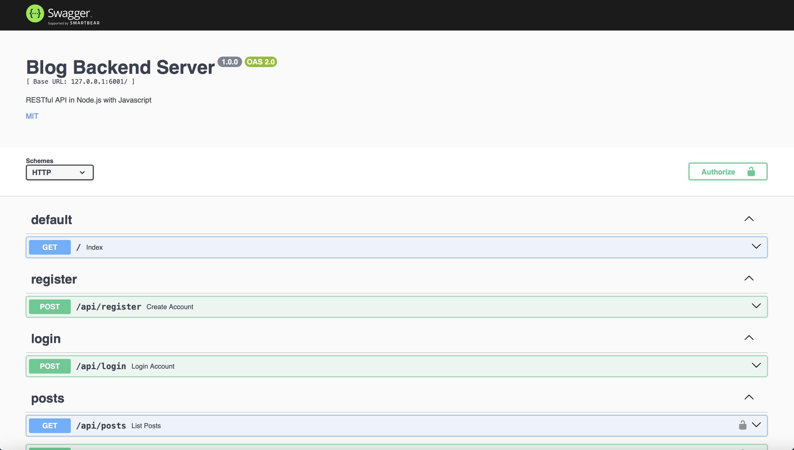

# RESTfulAPI-NodeJS 

基於Node.js技術打造的RESTful API部落格後端平台。

## 壹、基本說明
**ㄧ、開發者：**
許育誠
<br>

**二、目標：**
這個RESTful API平台旨在為前端提供便捷的部落格帳戶與貼文管理功能，支援用戶註冊、登入、創建及瀏覽貼文等操作。平台的開發基於PostgreSQL、Node.js及相關套件，除了實現常見的安全防護機制外，還特別針對軟體的正確性與完整性進行了嚴謹的單元測試，使用Jest測試框架來確保系統的穩定性與可靠性。
<br>

**三、開發環境：**
以下是開發該平台所採用的環境：
* 虛擬機：Docker
* 作業系統：Debian
* 程式語言：JavaScript
* JavaScript執行環境：Node.js
* Node.js資源管理工具：npm
* 資料庫：PostgreSQL（分別安裝postgresql與postgresql-client）
* 程式編輯器：Visual Studio Code

**四、使用相依套件：**
以下是開發該平台所使用的Node.js套件：
* express（Web應用程式架構）
* dotenv（將敏感變數放入環境變數中）
* bcrypt（密碼雜湊函式）
* jsonwebtoken（JSON Web Token）
* pg（JavaScript與PostgreSQL的聯繫工具）
* sequelize（基於Node.js的非同步ORM框架）
* swagger（建立RESTful API文件工具）
* jest（單元測試工具）
* supertest（單元測試Node.js時，模擬http請求的套件）
* cross-env（單元測試Node.js時，跨平台傳遞環境變數的套件）
  
**五、對於RESTful API請求：** 
以下是此後端平台提供的RESTful API端點，包含對應的http方法、路徑及參數說明，如下所示：
* `GET` /：首頁
* `POST` /api/register：創建帳號
* `POST` /api/login：登入帳號
* `POST` /api/posts：儲存貼文
* `GET` /api/posts或`GET` /api/posts?limit=列出資料筆數&offset=從第幾筆資料開始列出：查詢貼文
> [!Note]
> 此GET請求採用偏移分頁方法，使用兩個參數：offset（資料集中的起始位置）和limit（返回的資料數量）。其中，offset通常表示搜尋結果的第一筆資料的索引（需注意，資料集的索引是從0開始計算），而limit則指定響應中返回的資料筆數。例如，請求`GET`  api/posts?limit=10&offset=0 中，limit=10表示返回10篇貼文，offset=0則表示從資料集的第0筆貼文開始計算。若採用沒有參數傳遞方法（`GET` /api/posts），則會列出所有搜尋結果。
* `PUT` /api/posts：更新貼文
* `DELETE` /api/posts：刪除貼文

**六、檔案說明：** 
此專案檔案（指coding這個資料夾）主要分為兩個資料夾：nodejs和tests。其中，nodejs資料夾為後端平台的主要程式碼，tests資料夾則存放使用jest框架進行的單元測試。接下來將對各資料夾中的檔案內容進行詳細說明。
1. nodejs
   * .env：儲存環境變數
   * db.js：連結資料庫
   * server.js：建立http伺服器
   * index.js：首頁，為`GET` /的程式碼
   * register.js：註冊帳號，為`POST` /api/register的程式碼
   * login.js：登入帳號，為`POST` /api/login的程式碼
   * posts.js：貼文管理，為`POST` /api/posts、`GET` /api/posts、`PUT` /api/posts和`DELETE` /api/posts的程式碼
2. tests
   * index.test.js：對`GET` /的單元測試程式碼
   * register.test.js：對`POST` /api/register的單元測試程式碼
   * login.test.js：對`POST` /api/login的單元測試程式碼
> [!Warning]
> 請特別注意，由於node_modules資料夾包含大量且龐大的檔案，專案中用於存儲Node.js依賴的此資料夾並未包含在內。如果您選擇從GitHub下載專案並進行平台建置，請務必先安裝相依套件，相關安裝步驟將於後續說明中詳細提供。

**七、安全機制：** 
主要運用六種方法來進行平台安全保護，分別如下所示：
1. 密碼採用了bcrypt加密演算法進行Hash處理，並設置了saltRounds=12，使得加密過程更加複雜，從而提升了抗破解的難度。這樣的設計大幅增強了使用者密碼的安全性，有效降低了遭受暴力破解攻擊的風險。
2. 平台將對User資料表中已註冊的email帳號進行檢查，並自動阻擋重複註冊，確保每個帳號的唯一性。
3. 透過使用.env配置檔與dotenv套件，我們將敏感資訊獨立存放在.env檔案中，避免將重要資料直接暴露於程式碼中。當伺服器啟動時，系統會自動載入.env檔案中的資料，並將其設置為環境變數，以確保資訊的安全性與靈活配置。
4. 採用JWT驗證機制，有效防範未經授權的用戶訪問，確保只有持有有效憑證的用戶才能進入系統。（憑證時間有效時間為24小時）
5. 採用白名單機制，僅允許名單中的IP和網域進行訪問，從而加強系統的安全性，確保只有授權的來源能夠使用服務。（白名單目前只有IP：127.0.0.1與localhost可使用）
6. 對於使用者輸入的密碼與電子郵件，系統將進行有效性驗證。密碼必須符合至少6個字元的長度要求，並對電子郵件格式進行檢查，確保其有效性。
   
**八、RESTful API說明文件：** RESTful API說明文件是使用Swagger編輯生成的，請在啟動後端平台後，透過瀏覽器訪問 /api-docs 以查看詳細文檔。
<br>
  <div align="center">
  	
  </div>
<br>

## 貳、操作說明
**ㄧ、下載程式方式：** 
檔案來源主要有兩種方式，具體如下所示：
1. 從GitHub下載該檔案，並在有安裝Node.js與PostgreSQL的環境下，執行該程式。
2. 透過Docker Hub搜尋randysonnyson/nodejs_blogging_api下載映像檔，該容器中除了Node.js外，PostgreSQL也安裝於其中。

**二、安裝程式方式：** 
根據不同的檔案來源，接下來的系統架設方式將有所區別，具體操作方式如下：
1. GitHub：若從GitHub下載檔案，則需先架設程式運行環境，其步驟如下：
  * PostgreSQL
    * 請事先安裝好PostgreSQL，並啟動。在將資料庫帳號postgres，密碼設為123456。
    * 建立資料庫：指令如下：
    ```psql
    CREATE DATABASE ccsrdd
    ```
    * 資料表：由於本後端平台使用Sequelize進行資料操作，程式執行過程中會自動將資料物件映射到資料庫，因此無需手動創建資料表。以下分別為Node.js程式中User和Post的物件資訊：
    ```js
    const User = db.define("User", {
        username: {
            type: Sequelize.STRING,
            allowNull: false
        },
        email: {
            type: Sequelize.STRING,
            allowNull: false
        },
        password: {
            type: Sequelize.STRING,
            allowNull: false
        }
    });

    const Post = db.define("Post", {
        title: {
            type: Sequelize.STRING,
            allowNull: false
        },
        content: {
            type: Sequelize.STRING,
            allowNull: false
        },
        author: {
            type: Sequelize.STRING,
            allowNull: false
        }
    });
    ```
  * Node.js程式碼：請事先安裝好Node.js與NPM，其設定步驟如下：
    * 下載程式碼，並解壓縮。
    * 安裝相依套件
    ```shell
    npm init
    npm install express
    npm install dotenv
    npm install bcrypt
    npm install jsonwebtoken
    npm install pg
    npm install sequelize
    npm install swagger
    npm install jest
    npm install supertest
    npm install cross-env
    ```
    * 創建儲存環境變數檔案.env，內容如下：（此檔案務必要於nodejs資料夾中新增，否則將造成平台無法運作）
    ```.env
    BCRYPT_SALT_ROUNDS = "12"
    JWT_SECREC_KEY = "HlUf$R6Vi0sO1aP"
    DB_HOST = "localhost"
    DB_PORT = "5432"
    DB_USER = "postgres"
    DB_PASSWORD = "123456"
    ```
    * 啟動伺服器，請執行以下指令啟動伺服器：
    ```shell
    cd 檔案位置/coding/nodejs
    node server.js
    ```
2. Docker（較為建議的安裝方式）：
  * 若選擇使用Docker容器運行，請在有安裝Docker的終端機執行以下指令：
  ```shell
  docker pull randysonnyson/nodejs_blogging_api
  ```
  * 下載後，執行以下指令啟動容器：
  ```shell
  docker run -it -p 6001:6001 --name testAPI randysonnyson/nodejs_blogging_api        
  ```
  * 執行以下指令啟動資料庫與伺服器：
  ```shell
  sudo service postgresql start
  cd /root/CCSRDD/nodejs
  node server.js
  ```

**三、運行程式方式：**
呼叫此後端平台有多種方式，本篇將介紹以下兩種主要方法。平台的request與response皆為json格式，詳細說明請詳見RESTful API說明文件。
1. API測試工具軟體：如Postman、Hoppscotch等軟體。
<br>
  <div align="center">
  	
  </div>
<br>
2. 透過Swagger
<br>
  <div align="center">
  	
  </div>
<br>

> [!Warning]
> 請特別注意，目前程式中的白名單僅允許127.0.0.1與localhost進行連接，port為6001。另一方面，在呼叫`POST` /api/posts與`GET` /api/posts時，需要輸入JWT來進行驗證，因此請先至`POST` /api/login獲取JWT。
   
## 參、單元測試
檔案中包含對平台兩個API的單元測試，測試程式碼位於./tests資料夾內，分別針對`POST` /api/register與`POST` /api/login進行評估。操作方式如下所示：（以Docker容器運行為例）
```shell
cd /root/CCSRDD
npm test
```
<br>
  <div align="center">
  	
  </div>
<br>

>  [!Note] 
>  此部分僅展示作者如何使用 Jest 進行後端平台的單元測試，並非最完整的測試方法。由於本後端平台涉及資料庫的讀寫操作，若需進行完整測試，則需額外配置測試用資料庫並編寫相應的測試腳本。
